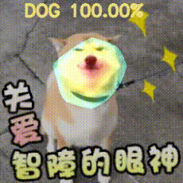

# Dogs_VS_Cats

__[Dogs_VS_Cats competition](https://www.kaggle.com/c/dogs-vs-cats-redux-kernels-edition)__ on __[Kaggle](https://www.kaggle.com/)__
__Using Transfer Learning__

## Requirements
* __[TensorFlow](https://www.tensorflow.org)__
* __[Keras](https://www.keras.io)__
* __[OpenCV](https://www.opencv.org)__
* __[Scikit-Learn](http://scikit-learn.org/stable/)__

## Results
|   Base Model/Model   | LogLoss  | Ranking |
| :--------:           |     ----:|     --: |
| Inception V3         |   0.04095|      <20|
| Xception             |   0.04101|      <20|
| Inception ResNet V2  |   0.03796|        8|
| Merge                |   0.03582|        7|

## CAM Visualization

__Jupyter Notebook [here](https://github.com/YinengXiong/Dogs_VS_Cats/blob/master/CAM/CAM%20Visualization.ipynb)__

[Class Activation Mapping](https://www.cv-foundation.org/openaccess/content_cvpr_2016/papers/Zhou_Learning_Deep_Features_CVPR_2016_paper.pdf)
> Zhou B, Khosla A, Lapedriza A, et al. Learning deep features for discriminative localization[C]//Computer Vision and Pattern Recognition (CVPR), 2016 IEEE Conference on. IEEE, 2016: 2921-2929.

